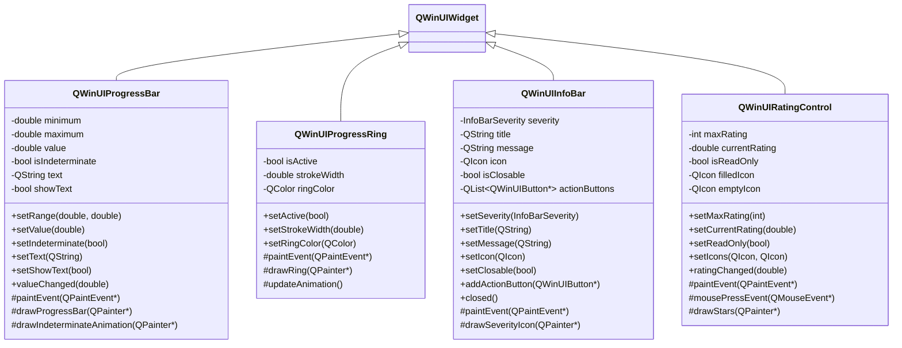
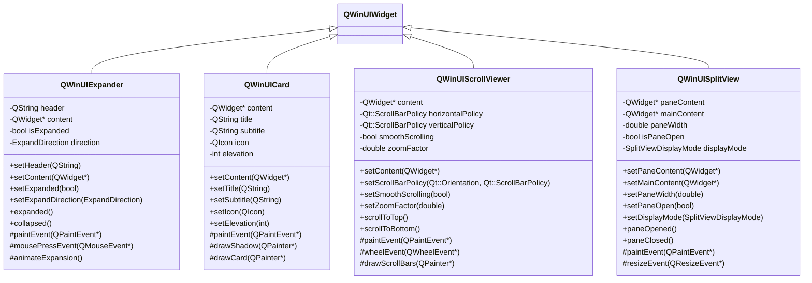

# QWinUI - Qt WinUI3风格组件库设计文档

## 概述

QWinUI是一个基于Qt的自定义组件库，严格遵循Microsoft WinUI3和Fluent Design System的设计规范，为Qt应用程序提供现代化的Win11风格用户界面组件。

## 设计原则

- **Fluent Design System**: 遵循Microsoft的设计语言
- **Win11风格**: 现代化的圆角、阴影、透明效果
- **响应式设计**: 支持不同屏幕尺寸和DPI
- **主题支持**: 支持浅色/深色主题切换
- **无障碍访问**: 符合无障碍设计标准

## 核心组件架构

### 基础类层次结构

### 导航组件

### 数据展示组件

### 输入控件组件

### 进度和状态组件

### 容器和布局组件

### 对话框和弹出组件

### 主题和样式系统

### 特殊效果组件

## 组件功能特性

### 基础控件特性

| 组件 | 主要特性 | WinUI3对应 |
|------|----------|------------|
| QWinUIButton | 圆角、悬停效果、点击动画、图标支持 | Button |
| QWinUITextBox | 浮动标签、错误状态、密码模式、验证器 | TextBox |
| QWinUICheckBox | 三态支持、动画切换、自定义样式 | CheckBox |
| QWinUIRadioButton | 分组管理、动画效果、自定义外观 | RadioButton |
| QWinUIToggleSwitch | 滑动动画、开关状态、内容标签 | ToggleSwitch |
| QWinUISlider | 平滑滑动、刻度显示、范围限制 | Slider |
| QWinUIComboBox | 下拉动画、搜索过滤、自动完成 | ComboBox |

### 导航控件特性

| 组件 | 主要特性 | WinUI3对应 |
|------|----------|------------|
| QWinUINavigationView | 自适应布局、面板切换、层级导航 | NavigationView |
| QWinUITabView | 标签页管理、拖拽重排、关闭按钮 | TabView |
| QWinUIBreadcrumbBar | 路径导航、点击跳转、溢出处理 | BreadcrumbBar |

### 数据展示特性

| 组件 | 主要特性 | WinUI3对应 |
|------|----------|------------|
| QWinUIListView | 虚拟化、选择模式、自定义项模板 | ListView |
| QWinUIGridView | 网格布局、响应式设计、项目大小调整 | GridView |
| QWinUITreeView | 展开折叠、层级显示、延迟加载 | TreeView |

### 容器和布局特性

| 组件 | 主要特性 | WinUI3对应 |
|------|----------|------------|
| QWinUIExpander | 展开动画、方向控制、内容容器 | Expander |
| QWinUICard | 阴影效果、圆角边框、内容承载 | 自定义Card |
| QWinUIScrollViewer | 平滑滚动、缩放支持、滚动条样式 | ScrollViewer |
| QWinUISplitView | 面板切换、响应式布局、显示模式 | SplitView |

### 反馈和状态特性

| 组件 | 主要特性 | WinUI3对应 |
|------|----------|------------|
| QWinUIProgressBar | 进度显示、不确定状态、文本标签 | ProgressBar |
| QWinUIProgressRing | 环形进度、动画效果、颜色自定义 | ProgressRing |
| QWinUIInfoBar | 严重级别、操作按钮、自动关闭 | InfoBar |
| QWinUIRatingControl | 星级评分、只读模式、自定义图标 | RatingControl |

### 对话框和弹出特性

| 组件 | 主要特性 | WinUI3对应 |
|------|----------|------------|
| QWinUIContentDialog | 模态对话框、按钮自定义、异步显示 | ContentDialog |
| QWinUIFlyout | 轻量弹出、位置控制、轻触关闭 | Flyout |
| QWinUITeachingTip | 教学提示、箭头指向、自动定位 | TeachingTip |
| QWinUIToolTip | 悬停提示、延迟显示、智能定位 | ToolTip |

## 设计规范

### 颜色系统

- **主色调**: 系统强调色（可自定义）
- **中性色**: 8级灰度色阶
- **语义色**: 成功、警告、错误、信息
- **透明度**: 支持Acrylic材质效果

### 字体系统

- **主字体**: Segoe UI Variable
- **备用字体**: 微软雅黑、苹方、Roboto
- **字号**: 12px-28px，支持缩放
- **字重**: Light、Regular、SemiBold、Bold

### 间距系统

- **基础单位**: 4px
- **常用间距**: 4px、8px、12px、16px、20px、24px、32px、40px
- **组件内边距**: 8px-16px
- **组件外边距**: 4px-24px

### 圆角系统

- **小圆角**: 2px（小按钮、输入框）
- **中圆角**: 4px（按钮、卡片）
- **大圆角**: 8px（面板、对话框）
- **超大圆角**: 16px（特殊容器）

### 阴影系统

- **浅阴影**: 0 1px 3px rgba(0,0,0,0.12)
- **中阴影**: 0 4px 12px rgba(0,0,0,0.15)
- **深阴影**: 0 8px 24px rgba(0,0,0,0.18)
- **超深阴影**: 0 16px 48px rgba(0,0,0,0.24)

## 实现要点

### 性能优化

1. **虚拟化**: 大数据列表使用虚拟化技术
2. **缓存**: 样式和绘制结果缓存
3. **异步**: 动画和复杂计算异步处理
4. **内存管理**: 智能资源释放和重用

### 无障碍支持

1. **键盘导航**: 完整的Tab键导航支持
2. **屏幕阅读器**: ARIA标签和语义化
3. **高对比度**: 高对比度主题支持
4. **缩放**: 支持系统DPI缩放

### 国际化支持

1. **RTL布局**: 从右到左语言支持
2. **字体回退**: 多语言字体支持
3. **文本方向**: 自动文本方向检测
4. **日期时间**: 本地化日期时间格式

### 主题切换

1. **实时切换**: 运行时主题切换
2. **系统同步**: 跟随系统主题变化
3. **自定义主题**: 支持用户自定义主题
4. **动画过渡**: 主题切换动画效果

## 开发计划

### 第一阶段：基础框架
- [ ] QWinUIWidget基类实现
- [ ] QWinUITheme主题系统
- [ ] QWinUIStyle样式引擎
- [ ] 基础动画框架

### 第二阶段：核心控件
- [ ] 按钮类控件（Button、ToggleButton等）
- [ ] 输入类控件（TextBox、ComboBox等）
- [ ] 选择类控件（CheckBox、RadioButton等）

### 第三阶段：高级控件
- [ ] 导航控件（NavigationView、TabView）
- [ ] 数据展示控件（ListView、GridView）
- [ ] 容器控件（Expander、Card等）

### 第四阶段：特效和优化
- [ ] Acrylic材质效果
- [ ] Reveal高亮效果
- [ ] 性能优化和测试
- [ ] 文档和示例完善

这个设计文档提供了完整的QWinUI组件库架构，严格遵循WinUI3的设计规范，包含了所有主要组件的UML类图和详细的实现规划。
